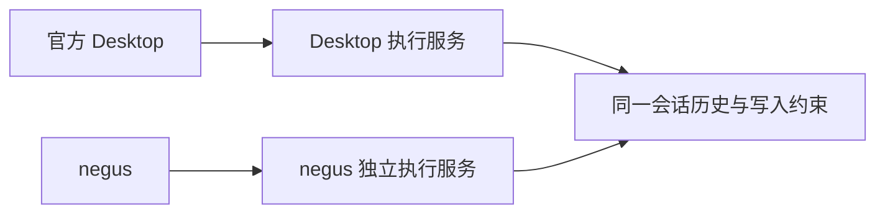
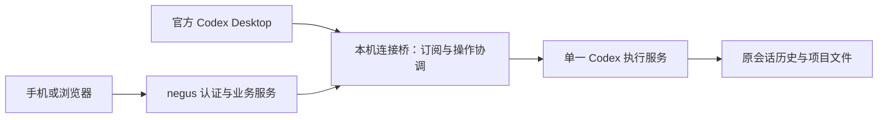

# Codex Desktop 与 negus 同会话协作调研报告

- 任务编号：RESEARCH-004；关联功能：FEAT-005、FEAT-001、FEAT-009。
- 更新日期：2026-09-14 17:58 +08:00。
- 调研基线：`84051f7a43d4037f4502333dac1c2bda71397ef2`，分支 `codex/publish-current-panel`。
- 范围：Windows 官方 Codex Desktop 与 negus 普通单聊的连续使用、实现差异、风险和验收方案。
- 状态：报告完成；共享连接方案尚未实现，产品验收待完成。本报告不代表已修复或上线。

## 1. 决策结论

推荐推进“官方 Desktop 与 negus 共用一个 Codex 执行服务”的验证实现。保留官方桌面界面，在后台增加连接桥和运行管理，并改造 negus 的连接方式。核心收益是消除两个独立执行进程对同一会话的写入竞争。

这条路线具备三个依据：本机已复现旧架构的占用问题；当前安装的 Desktop 代码确有外接 WebSocket 入口；社区已有相同方向的公开实现。它足以支持进入开发验证，但尚不足以宣布整套产品体验已经通过验收。

改动规模评估为中等，运行稳定性风险偏高。难点集中在 Desktop 启动和升级、审批路由、断线恢复以及现有自动重启逻辑。不是换一个连接地址就能完成。

需要单独判断两个产品目标：

| 产品目标 | 本轮结论 |
| --- | --- |
| 保留官方 Desktop、同一会话、运行时另一端可读、结束后另一端续聊 | 推荐路线可据此实施；必须通过真实双端验收 |
| 运行时禁止另一端启动或干预任务 | 需要连接桥统一仲裁，不能只禁用 negus 按钮 |
| 官方 Desktop 自动灰掉输入框，并明确显示“negus 正在使用” | 未证实；共享后端不会自动提供定制桌面 UI，需独立验证或另做桌面适配 |
| 官方提供稳定、受支持的第三方 Desktop 接管接口 | 本次没有找到这样的公开保证；已找到的是公开实验传输和本机隐藏接入口 |

## 2. 用户要求与范围

用户要求保留官方 Codex Desktop，在电脑与 negus 之间继续同一会话。任务执行期间，另一端能读取内容但不能抢占；任务完成后恢复发送，无需每次关闭 Desktop、复制历史或创建分叉。

“结束后解锁”在产品层表示下一轮可从另一端发起，不要求底层一定释放文件写入锁。共享服务可以继续持有会话，只把操作权按轮次切换。

本轮仅交付调研文档和 Git 提交。不修改运行代码，不安装竞品，不改 Desktop 包，不重启现有服务。后续首轮实现范围建议限制为普通单聊和当前账号运行环境；员工、群聊、独立供应商、生图和全部桌面插件能力不自动计入验收通过范围。

## 3. 证据等级和环境

| 等级 | 含义 | 本报告使用方式 |
| --- | --- | --- |
| 本机实测 | 本次会话工具执行获得的结果 | 支持占用复现和读取能力结论 |
| 本机源码确认 | 读取项目或安装包代码 | 支持接入口存在、现有恢复与审批机制结论 |
| 官方文档 | 公开协议及官方仓库页面 | 支持接口语义与支持状态；用户提案不等于官方承诺 |
| 竞品自述 | 竞品仓库或文档 | 作为路线参考，不等同于本机验证 |
| 设计建议 | 基于上述证据形成的实现方案 | 必须经实现和验收后才能成为已交付能力 |

本机环境：Windows，Codex Desktop 包版本 `26.908.4834.0`，本次探测使用的 CLI 版本 `0.154.0-alpha.6.2`。已确认 CLI 登录状态为 ChatGPT，且 negus 原客户端调用 `account/read` 返回账号类型 `chatgpt`。这证明认证读取链路可用，不证明每个模型、付费能力或工具均可使用。

报告公开版不保存个人会话标题、完整会话 ID、正文、认证信息或绝对用户路径。下文用 A、B 代称会话。复现结果来自本次会话中的工具输出摘要，未额外保存完整原始日志；后续验收应保存脱敏命令、版本、时间和结果。

## 4. 现状与实际复现

### 4.1 现有架构

`windows/scripts/remote-room-demo.mjs` 创建 `label: current` 客户端。客户端自行启动 `codex app-server` 并通过标准输入输出通信。Desktop 使用自己的执行服务。两个服务可以读取同一份持久化历史，但不共享运行中的任务对象与订阅。

### 4.2 已完成的复现

| 步骤 | 条件与操作 | 实际结果 | 可以得出的结论 |
| --- | --- | --- | --- |
| 1 | Desktop 正在执行会话 A；negus 调用 `thread/read`，包含历史 | 成功，读到 19 轮；独立服务报告 `notLoaded` | 可以读到历史；`notLoaded` 不代表 Desktop 空闲；不证明流式内容完整实时同步 |
| 2 | 已完成会话 B 尚未在 Desktop 加载；negus 读取、续接 | 读取成功，1 轮已完成；续接成功并报告 idle | 该会话原本可以被 negus 加载；不是账号或历史格式阻塞 |
| 3 | negus 退订并关闭自身探测进程；在 Desktop 打开 B；再从独立 negus 客户端续接 | 报错 `already has an active writer` | Desktop 加载后存在写入占用 |
| 4 | Desktop 切换离开 B，回到 A；再次读取和续接 B | 读取成功；续接仍报相同错误 | 页面切换没有立即释放 B 的写入占用 |

以上没有向 B 发送新消息，没有杀死 Desktop，也没有修改业务文件。它证明“已完成且切换走仍无法续接”确实发生；没有测量长期空闲后多久释放，也没有证明所有 Desktop 版本行为相同。

### 4.3 根因解释

“模型回答结束”“页面不再选中”“服务卸载会话”是不同事件。独立 negus 服务无法仅凭自己的 idle/notLoaded 判断 Desktop 是否释放写入权。因此只加按钮解锁、完成后重试或切换页面检测，不能可靠解决当前根因。

## 5. 官方支持与本机接入口

官方协议提供会话读取、续接、轮次启动及完成事件。读取不等于加载运行实例，完成事件不等于释放会话。退订作用于当前连接，满足无订阅且无活动的条件后仍有延迟清理。WebSocket 可以作为连接传输，但官方明确标为实验性、不支持生产工作负载。[官方 App Server 文档](https://learn.chatgpt.com/docs/app-server)

官方仓库的 [#21889：显式 thread/unload 提案](https://github.com/openai/codex/issues/21889) 在本次核对时仍为 Open。它提出立即卸载单条会话的需求，不是已发布接口或排期承诺。即使将来增加卸载，也仍需 Desktop 协作，不能推导 negus 能释放另一个进程的会话。

本机安装包只读检查确认：

- 存在 `CODEX_APP_SERVER_WS_URL`，用于选择连接地址，代码也读取 `websocket_url`。
- 设置 `CODEX_APP_SERVER_FORCE_CLI=1` 的分支会跳过该地址选择。
- 存在 `CODEX_CLI_PATH`，用于运行文件选择。

这些是当前版本的实现证据，不是公开稳定配置承诺。本轮没有通过重启 Desktop 实测这些入口的完整运行行为，也没有修改环境变量。接入口存在不代表桌面工具、审批、插件等全部能力在外接模式下已经验证。

官方自有远程控制能力与第三方 negus 接入是两回事。本次没有获得可以直接交给 negus 使用的、公开稳定的 Desktop 远程控制契约，因此不把官方自有功能当作现成第三方方案。

## 6. 竞品对比

| 项目及直接来源 | 公开路线 | 对本项目的价值 | 证据边界 |
| --- | --- | --- | --- |
| [Codex Local Remote](https://github.com/wlyaaaaa/codex-local-remote) | 官方 Desktop 与手机侧服务连接共享 Broker | 与本需求最接近，保留桌面界面 | README 将 v0.1.5 与未发布 Windows 修复候选区分，并说明真实恢复验收尚未完成；未在本机安装 |
| [codapter](https://github.com/kcosr/codapter) | 通过 `CODEX_CLI_PATH` 让官方 GUI 使用协议适配后端 | 证明可将桌面界面与后端适配分开考虑 | 主要解决后端适配，不能直接视为双端协作成品 |
| [codex-away 交接记录](https://github.com/akibrhast/codex-away/blob/main/docs/live-thread-handoff.md) | 记录独立运行实例的写入冲突及受管理服务连接实验 | 与本机报错相互印证，说明实例归属是关键 | 其测试版本、终端交接结果不能替代当前 Desktop 验收 |
| [HAPI 工作原理](https://hapi.run/docs/guide/how-it-works) | 通过包装 CLI 连接移动端 | 可参考事件同步和终端/手机切换 | 不是官方 Desktop 同会话接入的证据 |
| [Happier Codex 文档](https://docs.happier.dev/agents/codex) | 提供 app-server 路线和本地终端控制、移动交互 | 可参考运行中输入的协调方式 | 终端本地控制不等于官方 Desktop 接管 |

Codex Local Remote 的[架构说明](https://github.com/wlyaaaaa/codex-local-remote/blob/main/docs/architecture.md)指出，两端连接同一服务仍需分别订阅；新会话要在桌面订阅就绪后才派发首轮。这提示 negus 必须做事件同步与订阅协调，不能认为“共享地址”自动等于“共享所有 UI 状态”。

上述为一手文档比较，不包含竞品实机测试、性能排名或稳定性背书。外部链接多指向可变 main 或在线文档，应结合本报告日期阅读。

## 7. 方案选择

| 方案 | 对产品要求的符合度 | 结论 |
| --- | --- | --- |
| 保留两个服务，结束后不断重试续接 | 不能保证 Desktop 放锁；可能长期等待 | 不作为正式方案 |
| 每次关闭 Desktop 或杀掉执行服务 | 影响其他任务，不符合连续使用 | 不采用 |
| Fork/复制历史成为另一会话 | 不符合同一会话定义 | 不采用 |
| 重做 negus 桌面客户端 | 改变用户要求的官方 Desktop 使用方式 | 不在范围 |
| 依赖桌面 UI 自动化或私有 IPC 代发 | 可能受窗口、焦点与版本影响 | 不作为首选；不在本轮验证范围 |
| 官方 Desktop 与 negus 共享服务，后台桥统一协调 | 符合核心同会话方向 | 推荐验证实施 |

## 8. 推荐方案：现状—修改方式—使用体验

| 现状 | 修改方式 | 修改后目标体验 |
| --- | --- | --- |
| 两端争抢会话 | 两端连接同一执行服务，沿用原会话 ID | 来回继续同一段对话，不复制历史 |
| 完成后仍被占用 | 按实际轮次状态管理提交权，而不是强制卸载 | 回答结束即可从另一端发下一条 |
| 另一端可能只看见旧快照 | 订阅、事件补齐、重连后核对 | 能跟随进度和最终结果 |
| 两端各自恢复服务 | 生命周期从普通客户端拆出 | negus 重启或手机掉线不打断桌面任务 |
| 启动时各自创建服务 | 增加共享模式启动协调 | 首次接入需在任务完成后重开 Desktop；日常轮次交接不重启 |

### 8.1 按会话管理操作权

建议状态为：确认中、空闲、执行中、等待用户处理、恢复中。确认中和恢复中保留读取能力，但暂不放行写操作。等待审批不属于空闲。不同会话分别协调，不设置全局单任务锁。

在空闲会话收到请求时，后台先占用该会话的派发位置，再提交给执行服务；两个入口同时发送只能接受一个，另一个明确返回冲突并保留草稿。正式轮次 ID 返回后绑定该轮次；成功、失败或中断的终态经核对后解除该轮次占用。连接断开和超时不能直接视为任务完成。

只读应覆盖所有干预当前任务的入口，包括新轮次、追加引导、停止、回滚和会话设置变更，不能仅限制 `turn/start`。模型或推理参数的本地草稿可以保留，实际执行变更必须遵守归属规则。审批由指定交互端处理一次，避免两端互相覆盖。

这是建议的产品规则，不是当前实现。默认不增加自动排队发送，避免用户误以为拒绝的消息稍后不会执行。

### 8.2 Desktop 体验边界

后台拒绝操作不等于 Desktop 的输入框自动禁用。若 Desktop 原生 UI 只展示错误提示，需要确认草稿是否保留、提示是否可理解，以及其队列是否会在任务结束后自动派发。原生自动排队若改变预期，必须作为验收失败处理，不能仅因“没有并行运行”就通过。

Desktop 的工作树、工具授权、插件和本机能力可能依赖原有宿主连接。共享服务应采用当前 Desktop 对应运行文件与用户环境；普通对话成功后，仍须核验产品实际依赖的桌面功能。

### 8.3 启动与退出

建议为共享模式提供单一启动协调入口：先确认服务健康，再以普通用户权限启动或接入 Desktop；只对该次子进程设置地址，不持久修改用户或系统环境。已有原生 Desktop 不能假定可热切换，首次转换安排在无任务运行时。

常规打开、系统重启、睡眠唤醒和 Desktop 自动更新都必须纳入生命周期测试。若用户从原生入口打开了独立服务，negus 应识别并停止发送，不能悄悄启动第二套服务补救。原生入口完全透明接入不是当前已完成能力。

关闭手机页或重启 negus 不停止共享执行服务。连接桥或执行服务本身退出时，两端都可能受影响；恢复必须先核对原任务，不能宣称任何任务都能无损续跑。

## 9. 相比当前实现的改动范围

以下为后续设计范围，文件路径是现有依据或拟新增位置，不表示本次已改代码。

| 模块 | 当前依据 | 需要调整的责任 | 复用程度 |
| --- | --- | --- | --- |
| 连接客户端 | [app-server-client.mjs](../../windows/server/app-server-client.mjs) | 支持外接传输；区分连接关闭和服务终止；移除共享路径的自动审批 | 接口可复用，生命周期需改 |
| 会话读取与状态 | [app-server-conversation-store.mjs](../../windows/server/app-server-conversation-store.mjs) | 外部发起轮次订阅、完成判定、重连核对 | 读取和现有轮次匹配逻辑可沿用 |
| 服务组装 | [remote-room-demo.mjs](../../windows/scripts/remote-room-demo.mjs) | 选择共享模式，注入客户端，禁止静默退回独立实例 | 保留主要业务路由 |
| 状态与实时分发 | [execution-tracker.mjs](../../windows/server/execution-tracker.mjs)、[realtime-hub.mjs](../../windows/server/realtime-hub.mjs) | 传达操作归属、恢复状态，避免重复或乱序投影 | 需具体接口设计后确定修改 |
| 供应商路由 | [model-provider-service.mjs](../../windows/server/model-provider-service.mjs) | 当前账号共享路径与独立供应商环境保持区分 | 不将所有客户端强行合并 |
| 后台连接桥及启动协调 | 拟新增模块，名称待实施时确定 | 请求关联、订阅、互斥、审批路由、版本和实例核验 | 新增核心组件 |
| negus 界面 | `web-ui/src/features/conversations/` | 只读原因、恢复提示、草稿保留 | 复用消息渲染和布局 |

源码中特别需要处理的现有行为：客户端 `automaticResponse` 自动接受部分审批；`probe` 在连续两次失败后触发 `restart`；`restart` 和 `close` 会结束其子进程。它们适用于客户端拥有自己服务的旧结构，不能原样用于共享服务。

## 10. 风险登记与应对

风险等级按影响和实现依赖定性评估，不是统计故障概率。下列缓解措施均为待实现要求。

| 编号 | 等级 | 风险与用户后果 | 缓解措施 | 剩余边界 |
| --- | --- | --- | --- | --- |
| R1 | 高 | Desktop 更新后隐藏入口或协议变化，无法接入或重新抢锁 | 记录版本；启动核验同实例；升级回归；不兼容时远程只读 | 官方未承诺该入口稳定 |
| R2 | 高 | 沿用 negus 自动重启/关闭逻辑，打断桌面任务 | 分离连接与服务所有权；共享客户端只能重连自身 | 共享服务自身崩溃仍影响双方 |
| R3 | 高 | 审批误路由或自动接受，用户确认被跳过 | 请求指定响应端；响应去重；未识别审批阻塞并提示 | 新审批类型需版本适配 |
| R4 | 高 | 接受结果超时后重发，任务重复执行 | 使用可用的请求标识核对；无法判定时暂停重试 | 不承诺网络异常下数学意义的恰好一次 |
| R5 | 中高 | 订阅不完整或事件乱序，显示旧状态并误放行 | 快照与事件衔接；核对会话和轮次；未知状态不可写 | 需要真实长任务及断线测试 |
| R6 | 中高 | Desktop UI 仍可输入、自动排队或草稿丢失 | 测试原生冲突显示和队列行为；必要时单独适配 | 可能达不到强制灰框的视觉要求 |
| R7 | 中高 | 启动入口、管理员环境或睡眠恢复产生错误实例 | 普通用户 Desktop；单一协调者；按进程身份核验 | 首次切换仍需受控重开 |
| R8 | 高 | 把底层远程执行接口暴露给网络 | 桥仅监听回环；公网只经过 negus 身份认证和授权；不输出凭据 | 回环并不替代本机访问控制与来源校验 |
| R9 | 中 | 接错账号或运行环境，模型/工具与原桌面不同 | 核对账号类型、Codex home 和 Desktop 对应运行文件；隔离供应商 | 账号读取成功不代表全部能力可用 |
| R10 | 中高 | 共享模式影响工作树、桌面工具、附件或其他任务 | 验收产品实际使用能力；不同会话独立协调 | 普通文字对话通过不能覆盖全部桌面功能 |

## 11. 分阶段实施与退出机制

### 阶段 A：最小双端验证

仅接入当前账号普通单聊，复用原会话。验证官方 Desktop 确实连接共享服务、两端看见同一轮次、完成后能交替续聊。未通过则不继续扩大到群聊和供应商。

### 阶段 B：可靠性与交互

补齐逐会话仲裁、审批归属、发送去重、断线恢复、草稿保持与版本识别。重点判断 Desktop 的原生只读/冲突体验是否满足用户要求。涉及桌面 UI 修改时单独列明范围，不能混入后台改造。

### 阶段 C：有限发布

在已验收的 Windows、Desktop 和 CLI 版本组合上开放共享模式。先保留原生模式的退出入口，记录不含正文和凭据的连接状态、错误和版本信息。再逐项扩展附件、工作树、员工或供应商场景。

本报告不给出未经实现验证的人天承诺。连接桥和客户端改造相对明确，Windows 启动恢复与原生 UI 行为是主要工作量变数。

退出共享模式时，先停止接受新任务，等待当前任务结束或由用户明确中断，再退出受管理实例并从原生入口打开 Desktop。沿用原账号目录和会话数据，不回滚或删除历史。不能以结束所有 Codex 进程作为常规回滚方式。服务异常时先确认任务状态，不盲目重复执行。

## 12. 产品验收矩阵

以下均为待执行；本轮没有将任何一项标为通过。每次记录版本、会话/轮次的脱敏标识、操作顺序、观察结果和耗时。

| 编号 | 场景 | 通过标准 |
| --- | --- | --- |
| A1 | Desktop 运行，negus 打开同一会话 | 持续看到公开进度和最终回答；negus 不发起、追加或停止该任务 |
| A2 | Desktop 完成，negus 续聊 | 不重开 Desktop、不换会话 ID、不等待卸载；新消息成功执行 |
| A3 | negus 运行，Desktop 打开同一会话 | 看见真实内容；冲突操作不执行，草稿不丢，提示可理解 |
| A4 | negus 完成，Desktop 续聊 | 不关闭 negus、不换会话，继续成功 |
| A5 | 两端同时发送 | 只接受一个执行请求；另一条明确保持未发送，不静默排队 |
| A6 | 任务等待审批或结构化输入 | 不误判为空闲；只有指定端一次有效回应，不自动接受 |
| A7 | 手机断网、刷新、重启 negus | Desktop 任务继续；重连补齐内容，不重复执行 |
| A8 | 发送后响应超时 | 先核对实际接收情况；不因自动重试产生第二轮 |
| A9 | 任务失败、中断及连接桥崩溃 | 正确显示终态或恢复中；不把断线当作完成，不虚构结果 |
| A10 | 两个不同会话同时运行 | 不使用全局锁阻塞无关会话；不互相释放操作权 |
| A11 | 系统睡眠、唤醒、重启及原生入口启动 | 恢复同实例或明确不可写；不悄悄创建冲突运行实例 |
| A12 | Desktop 更新、运行文件变化 | 重新验证兼容；不兼容时能退出共享模式且历史可读 |
| A13 | 工作树、附件、文件修改及实际依赖的桌面工具 | 路径、权限、审批与原体验一致，无工具能力静默缺失 |
| A14 | 退出共享模式 | 不丢历史、不误杀其他任务，可继续原生使用 |

“完成后立即续聊”的验收含义是：确认真实终态后可发送下一条，不额外等待退出、卸载或固定冷却期。同步耗时须实测记录，尚未制定或承诺毫秒级指标。

## 13. 账号与现有功能的关系

共享连接不改变订阅身份和服务端额度规则。本机已登录 ChatGPT，当前账号客户端认证读取成功；不能据此宣称订阅自动覆盖项目原有中转生图接口或第三方用量查询。独立供应商仍保留原有认证和运行环境。该方案解决同会话协作，不能同时被宣传为全功能订阅迁移完成。

## 14. 交付状态与后续决策

已完成：现状源码核对、实际占用复现、Desktop 接入口只读确认、官方与竞品资料比较、差异评估、风险登记和验收设计。

未完成：共享桥代码、Desktop 接入启动、真实双端交替执行、只读 UI、审批路由、异常恢复和升级验收。本轮是文档交付，不需要前端构建或运行代码测试；提交前检查 Markdown 本地链接和 Git 补丁格式。

建议下一项工作是阶段 A 的普通单聊验证。核心行为通过后再进入可靠性改造；若原生 Desktop 只读反馈不符合要求，应明确评估桌面 UI 适配，不以“后台已经拦截”代替产品验收。
