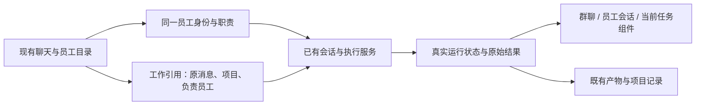

# Grok Bot 产品与 Agent 管理调研：Negus 的最小改造路径

- 任务：RESEARCH-20260925-01
- 调研日期：2026-09-25；整理时间：23:53 +08:00
- Negus 分支：`codex/publish-current-panel`
- 产品代码基线：`a3dd3f779649db3cb86bbf864d3c0d25f44c3488`
- 范围：竞品公开资料调研、当前代码及页面实现核对、最小改造建议、后续验收定义。没有开发授权，不修改产品代码。
- 状态：研究文档完成；Grok Bot 登录后真实体验未验收；Negus 候选方案尚未实施。
- 本文中的“建议”不改变现有产品定义，也不代表用户已经确认开发。

## 1. 产品判断

Negus 最值得借鉴的是 Grok Bot 的“长期同事”管理方式：用户记住少数有明确职责的人，把工作交出去，能够看到谁在做什么，在需要时纠正，收到可以核查的成果；下一次仍找同一个人。群聊、多个模型和更多头像只是入口，不是这个效果本身。

Negus 已经有长期员工、员工独立项目、直属单聊、每个项目群聊对应的长期会话、真实执行状态、成果发布和桌面任务入口。没有必要另建一套 Bot 身份、聊天系统、模型配置或工作台。

真正影响效果的缺口是：

1. 员工主要来自内置配置，创建、改职责、停用、复制的产品生命周期不完整。
2. 同一个群聊的执行仍是串行队列。多个员工出现在页面上，不等于他们可以独立并行工作。
3. 交接主要靠最终回复中的 @，没有完整的“委派—接单—结果回传—验收”任务关系。
4. 长期会话已经存在，但自动提炼经验的默认评审器返回空结果；不能把它称为自动学习。
5. 桌面自动化组件读取现有调度记录，不负责创建或执行任务；不能把“能看到定时任务”称为常驻员工。
6. 群级停止与内存执行状态限制了单项控制和重启恢复。

最小代价应分两档：

- **先获得“固定同事、可找可管、结果可回看”的效果**：复用现有员工目录、个人信息、单聊和当前任务组件，补足职责管理与来源绑定。这是较小范围。
- **再获得“交给团队后，分头工作、只停其中一项、回来可靠交付”的效果**：需要补齐执行记录、定向停止和有限并行。这是中等范围的运行逻辑改动，不能包装成几处 UI 调整。

持续在线、桌面接管、完整企业权限和公开模板市场属于另一档投入。它们不是第一阶段必需，也不能承诺低成本完全复刻。

## 2. 研究对象和证据强度

本次 Grok Bot 指 x.ai/bot 所指向的长期 AI 同事产品，不是普通 Grok 聊天、Grok Build，也不是 GitHub 上同名交易机器人、桌面表情项目或开源仿品。

### 2.1 来源分层

| 编号 | 来源 | 本次读取情况 | 可以支持什么 |
| --- | --- | --- | --- |
| S1 | [官方产品入口](https://x.ai/bot)、[介绍页](https://x.ai/news/introducing-grok-bot) | 连接超时，沙箱外只读重试仍失败 | 只记录官方入口，不能当作已读原文 |
| S2 | [官方文档入口](https://docs.x.ai/grok-bot/overview)、[开始使用](https://docs.x.ai/grok-bot/get-started) | overview 及 llms.txt 连接失败；overview 重试仍超时 | 作为后续核实入口，不据此断言当前版本功能 |
| S3 | [Grok Bot Field Notes](https://github.com/unicodef1wn/grokbot-field-notes/tree/02780c04ef5f412b28573bce6f82afd15d195d1f) | 成功读取 README、产品、编排、技能/例程、成本、PM 实例及直播笔记的相关部分 | 第三方整理的 2026 年 9 月直播材料；是二手证据，不是官方功能文档或本次实测 |
| S4 | [awesome-grokbot](https://github.com/kydlikebtc/awesome-grokbot/tree/3e972509340f577b33722e5ca2c69c11d77f95df) | 成功读取 README、核验方法与导入说明 | 社区模板生态与分享机制的旁证；作者明确未导入验证各 bot 的行为 |
| S5 | [Hacker News 发布讨论](https://news.ycombinator.com/item?id=49261514) | 经 Algolia API 读取帖子及部分顶层评论 | 使用者报告、FAQ 转引及体验问题；不是官方服务承诺 |
| N | Negus 当前工作区源文件、产品定义、功能档案 | 直接读取 | 对当前源码结构有较强证据；不能单凭源码证明已部署或真实体验通过 |

S3 的多个文件来自同一作者、同一场直播整理，不能把它们算作多份独立验证。直播原始录像未逐段复核，笔记中的“永久记住”“机器人看不到密码”等表述不作为本报告验证结论。S4 的数千条链接也不代表数千个经过验收的 Agent。

本轮没有安装 Grok Bot、登录其账号、导入模板、授予账号权限或执行付费任务。Negus 本机 `http://127.0.0.1:9360/` 只读 HEAD 返回 HTTP 200；没有真实浏览器操作，也没有发送员工任务。这个结果只证明入口有响应。

### 2.2 必须保留的冲突与未知

| 问题 | 资料差异 | 本文采用的结论 |
| --- | --- | --- |
| 每个 bot 是否独占 VM | S3 同时出现“独立 Linux VM”“共享文件系统”“同一 VM 的多个实例”；S4 明确称同账号共享一台电脑 | 能分头执行的产品体验有多份旁证；物理隔离、浏览器会话隔离与文件权限边界未证实。不能认定每 bot 一台安全隔离 VM |
| 记忆是否完全不共享 | S3 PRODUCT 称除消息外不共享；PM playbook 又描述私人记忆池和共享记忆池 | 长期角色记忆与有选择的信息共享是合理归纳；具体共享机制待核实 |
| 原生 Linux 客户端 | S3 day 1 把 Linux 列入平台；S4 说没有官方 Linux 桌面版 | Linux 执行环境不等于 Linux 客户端，当前支持平台不下定论 |
| 群聊是否每个 bot 都必答 | S3 产品摘要写每个 bot 都答；笔记另有仅被点名才更新知识库的例子 | 群聊容易产生噪声有证据；是否存在统一默认广播规则与可配置响应规则待实测 |
| 分享是否复制记忆 | S3 区分复制时清空记忆、分享时保留核心记忆并过滤工作区信息；S4 更强调配置、技能、例程和插件 ID | 模板与历史/凭证分离值得学习；自动脱敏与实际复制字段未验证 |
| 跨真人协作 | 8 月使用者报告不能邀请真人；9 月笔记仍称跨账号 bot 通信未提供 | 只能记录对应日期的限制，不能推断当前产品绝对没有多人功能 |
| 价格和额度 | HN 评论、直播促销提及多个价格/额度数字 | 不发布当前报价，不把促销额度当月费；成本分析用任务数、频率与调用量 |

这些冲突不会阻止做 Negus 的产品判断，但会阻止把“每员工独立电脑”“天然安全隔离”等说法作为架构前提。

## 3. 从产品经理角度理解 Grok Bot

### 3.1 服务谁、替代什么工作

最匹配的人群是需要持续跨工具办事、需要多项工作并行、又没有足够真人协助的负责人、产品经理、小团队创始人和运营人员。

它替代的主要工作不是写一句答案，而是：找资料、在工具间搬运信息、追问进展、反复介绍背景、收集成果、再次安排下一步。用户感知价值来自管理动作减少，而不是 bot 数量增加。

典型需求可以写成：

> 我同时推进几个事项，希望固定的专业助手自己接续上下文、调用已有工具并完成工作；只有遇到我必须决定的事情才来找我，我随时能知道任务到哪一步。

它更像跨应用的执行与协作层。Negus 则进一步希望把工作功能持续定制在自己的工作空间里。两者重合的是“长期执行者与共享工作链路”，并不要求 Negus 改成以聊天联系人为全部产品。

### 3.2 用户的完整使用循环

依据 S3/S4 重建的概念流程如下，不是本次对官方按钮位置的实测：

1. 从现有角色或模板开始，或描述一个具体职责，建立有名字的 bot。
2. 说明目标、资料来源、常用工具、可以自行决定的范围、什么结果算完成。
3. 在单聊里给第一件真实工作，观察产物与执行反馈，纠正一次做法。
4. 将有效方法沉淀为技能；需要长期重复时再设置例程。
5. 简单工作直接找专家；需要统筹时找负责人，由其联系其他 bot。
6. 在共享讨论里解决确实需要多方判断的问题，避免日常工作都广播。
7. 只在待决定、失败、异常或交付时占用用户注意力。
8. 定期调整职责、停用无效例程、清理重叠 bot，保留有用经验。

最值得复用的“第一次成功”不是创建五个 bot，而是一个 bot 完成一件跨工具工作、第二次还能用同样的方法成功。

### 3.3 对产品经理最有启发的实例

S3 的 PM workshop 用虚构航空公司 Flylo 演示：

- 数据 bot Ashley 查询购票与漏斗数据。
- 人误读漏斗后，bot 纠正问题位置，再交给产品助手 PMP 写 PRD。
- 设计 bot Pixel 与工程经理 Emily 分头推进。
- Emily 拆分范围，与工程 bot 单独沟通。
- 工程 bot 调用 Cloud Agents 执行，后续做验证。

这里可借鉴的是“数据问题—产品判断—需求—设计/工程—验证”保留同一工作来源，而不是复刻这些角色名字。示例中的业务数据、产出数量和效率口述不视为可复用的真实商业绩效。

对 Negus，一个员工产出的研究结论应能成为另一个员工的输入，并指回同一项目、消息和产物。用户不该复制到另一个窗口后再解释一遍。

## 4. Agent 管理方式拆解

### 4.1 管理对象不是一条聊天

| 对象 | 用户关心的问题 | 不应混淆的内容 |
| --- | --- | --- |
| 员工 / bot | 谁负责，擅长什么，长期规则是什么 | 不等于某个模型、某条 Thread |
| 一项工作 | 要得到什么，谁在做，结果在哪 | 不等于整段员工职业历史 |
| 会话 | 在什么场景讨论，前后背景是什么 | 不等于访问项目数据的授权 |
| 技能 | 下次如何可靠地再做一次 | 不等于私人记忆或定时器 |
| 例程 | 何时触发、何时停止、没变化怎么办 | 不等于一直在线的聊天 |
| 执行环境 | 文件、工具和账号从哪里来 | 不等于角色身份 |
| 公共项目知识 | 哪些事实、决定大家共同使用 | 不等于所有私聊默认互通 |

这也是 Negus 最应坚持的对象边界。新增一次临时研究，不应默认变成一个长期员工；更换模型也不应导致身份与会话归属改变。

### 4.2 创建、职责和团队规模

S3 的核心实践是一个 bot 有一个清楚的责任范围，但不是每个动作都新建 bot。创建前先判断已有员工加一个技能是否足够。

一份有用的职责说明至少包括：

- 负责的结果与不负责的范围；
- 权威资料来源、允许使用的工具；
- 基本工作方法和需要找谁交接；
- 输出要求与需要升级给用户的情况。

“Bot Factory”由一个 bot 帮忙创建其他 bot，是实践模式，不必直接等同于 Grok Bot 固定的系统组织架构。自动创建过多员工反而增加配置和管理负担。

对 Negus：角色已有 `name / responsibility / instructions / aliases` 等字段，应继续使用同一员工定义。第一阶段可通过自然语言改现有员工职责，不必新建一个复杂的组织后台。

### 4.3 名单组织与可发现性

S3 记录了侧栏 sections、标签、置顶，以及 Leadership、Engineering、War room 等实例。它们降低“我应该找谁”的成本，不是组织权限证明。

Negus 的员工项目目录已经能承担主要导航。优先让名称、职责、正在处理的事项和待用户决定的状态来自同一真实员工记录。搜索、置顶、分组只有在员工变多且寻找困难时才值得增加；本轮不建议改现有导航外壳。

### 4.4 单聊、群聊、负责人和临时执行者

S3 描述四种协作实践：

| 模式 | 适合什么 | 主要管理成本 | Negus 借鉴方式 |
| --- | --- | --- | --- |
| 直接找专家 | 范围明确的一件事 | 用户要知道找谁 | 沿用员工直属单聊 |
| 负责人协调 | 多环节、有依赖的工作 | 负责人可能变成额外转述层 | 用户主动委托负责人；专家仍可直接访问 |
| 多人讨论 | 多视角判断与争议 | 发言多、成本高、意见相互影响 | 保留显式 @；独立分析必须单独定义上下文边界 |
| 临时子执行者 | 批量处理、短期并行、验证 | 需要回收结果并核查 | 挂在工作下，不自动加入长期员工名单 |

“负责人替我管理”与“每件事必须先找负责人”不同。S3 中也有人偏好直接找专家，因此不建议把 Negus 普通群消息重新改成默认唤醒经理。

### 4.5 协作的关键是交接，而不是提及名字

Grok Bot 材料描述 bot 之间直接发消息、负责人给下属背景、专业员工再委派 Cloud Agents。产品价值是降低用户充当信息搬运工的成本。

Negus 目前已有一种有限交接：最终文本出现其他员工的 @ 后，系统把该员工追加到本轮队列，每轮同一员工最多唤醒一次。这是有效基础，但还不是可追踪的任务委派：

- “请研究员继续”与“研究员已接单”缺少独立的持久状态；
- 没有可靠的父子工作关系与自动回到委托人的验收闭环；
- 公开引用 @ 和真正派工需要更明确的意图边界；
- 当前回复完成不等于整个业务目标完成。

最小增强不是接入另一套消息总线，而是把现有交接补成结构化工作引用，再复用现有执行、结果和发布通道。

### 4.6 长期记忆、团队知识与技能

S3 强调持续纠正和按角色积累经验；但具体持久记忆机制有冲突，不能照抄未证实的“记忆池”设计。

对产品效果可分四层：

| 层次 | 示例 | Negus 适合的现有承载 |
| --- | --- | --- |
| 固定职责 | 研究员负责证据核对，不替其他员工完成评审 | employee 定义 |
| 当前工作上下文 | 本次研究哪三个竞品、截止范围是什么 | 原 Thread 与任务来源 |
| 项目公共事实 | 项目已经接受的术语、决策、验收条件 | 项目文档和公共记录 |
| 可复用方法 | 如何做一次带来源的竞品分析 | 已有规则/技能载体 |

最低成本优先支持用户明确说“以后按这个做”或“忘记这条规则”后的可核对变更，而不是每轮都调用额外模型自动总结。删除或纠正应有来源与版本；同一条规则不要同时成为多份独立可编辑正文。

现有成长审批写入 contextRoot，并不自动证明每个供应商、直属单聊和群聊都会读取它。实施时必须核对“保存在哪里—每次执行怎样加载—是否覆盖旧规则”的完整链路。

### 4.7 技能与例程

S3 将技能定义为“怎么做”，例程定义为“什么时候做”，并推荐先成功完成一次，再固化方法，最后定期触发。

例程的必要产品语义：归属员工、数据源、时间与时区或事件条件、预期结果、无事时安静、失败时如何处理、何时停用。日常汇报不应因为“常驻”就每几分钟空跑一次。

Negus 应复用已经存在的调度来源。当前桌面组件只读，没有证据支持从组件创建、暂停或可靠执行新员工例程。本轮不建议为了视觉对齐另建 cron 服务；调度接入必须验证实际执行主体和失败恢复。

### 4.8 运行控制与用户注意力

有价值的状态是“正在查哪件事、需要我做什么、结果能否检查”，而不是“在线”。

建议区分：

- 有任务正在运行；
- 有后续任务排队；
- 等待用户资料或授权；
- 中断、失败、状态暂时未知；
- 已交付，尚待用户验收。

员工可能同时有直属工作和项目群工作，因此“员工忙碌”应是现有运行记录的汇总，不是另一个手工状态。停止应针对一次执行，停用员工应阻止未来派工，两者不是删除历史。

S3 的“随时打断和纠正”有体验旁证；官方单项停止、继续、重试按钮及恢复语义未实测。不能将 Negus 后续设计描述成 Grok Bot 原样功能。

### 4.9 环境、权限与持续在线

跨工具执行包含 API/连接器和浏览器操作。S3/S5 支持后台运行、离开客户端仍可工作这一产品主张，但物理隔离边界未证实。

Negus 最低成本的后台能力来自现有服务器继续执行，关闭用户浏览器不应主动取消任务；如果服务就在用户合上的笔记本上，休眠后当然不能等同于云端常驻。需要分别验证“关页面”“断网”“主机休眠”“进程重启”。

权限不能仅用职责文本表达。现有 employee-runtime 有只读/可修改策略，但这不等于按工具、账号、员工划分的完整企业授权，更不等于每员工独占电脑。第一阶段无需复制云电脑产品，也不应向用户展示并不存在的“独立电脑”入口。

### 4.10 复制、分享与退役

S3/S4 都说明模板复用有价值，且不应复制凭证与聊天历史；具体记忆转移规则存在差异。

Negus 如果后续支持复制，建议采用明确字段白名单：名字/职责/指令、允许导出的技能引用、非敏感配置。新员工必须有新 ID、新会话和独立运行状态。权限不随复制自动扩大，定时任务不默认启动。

停用仅阻止新任务；既有运行项如何处理要有明确规则。历史产物、来源与项目参与记录应保留。公开模板市场、安装分发和跨用户账号共享不进入最小方案。

## 5. Negus 当前实现核对

以下均为本次源码发现，不是仅复制历史文档。

| 能力 | 当前证据与判断 | 对最小方案的意义 |
| --- | --- | --- |
| 员工身份 | `employee-definitions.mjs` 从 employee.json 加载，规范化职责、模型、别名、指令 | 继续用现有 employeeId；不另建 Bot |
| 生命周期 | `employee-project-registry.mjs` 从定义创建 Map，提供绑定和模型修改，没有完整 create/archive/duplicate API | 动态增删不能只改前端列表，也不能只往状态 JSON 塞一条 |
| 直属长期会话 | `employee-runtime-service.mjs` 维护员工与 thread、conversation 绑定；按 employeeId 发送锁 | 身份与持续单聊基础可复用；不同员工有独立通道的代码基础，实际并发未测 |
| 群聊长期会话 | `multi-agent-service.mjs` ensureThread 恢复/建立员工 Thread；组装入口注入 employeeWorkRoots | 工作项目和员工会话归属继续分开 |
| 当前路由 | `agent-routing.mjs` 按显式 @ / requestedAgentIds 路由；最新功能记录明确无 @ 不唤醒 | 保留用户现有习惯，不恢复旧的经理默认接待 |
| 同群调度 | `multi-agent-service.mjs:47` 单个 currentRun，48 行 workQueue；runDiscussion 顺序 await | 同群并行不是已有能力，不能仅 Promise.all |
| 停止 | interruptDiscussion 取消本房间所有 discussions，并停止 currentRun | 要做单项停止需明确 job/work/run 身份和取消目标 |
| 上下文 | `group-room-store.mjs` getAgentContext + `discussion-prompt.mjs` 按点名、引用、新消息组织 | 能复用选择逻辑；并行独立意见还需固定输入快照和限制共享产物 |
| 执行记录 | activeWorks 在内存 Map；消息有 workId；begin/finish 操作不构成可恢复任务账本 | 复用 ID/消息，不再造平行任务系统；补持久化生命周期 |
| 结果发布 | `agent-publication-service.mjs` 按 requestId 去重，校验原回复与目标房间，保存来源 | 复用单次结果/来源机制；自动回传与普通手动分享语义仍需区分 |
| 成长 | `employee-growth-reviewer.mjs` 默认 facts/rules/skills 均空；启动入口无 review 注入 | 不能宣称自动学习已运行 |
| 规则/技能 | `employee-growth-service.mjs` 批准后写 contextRoot 的 AGENTS.md / SKILL.md；getContext 返回已存事实与提案 | 已有载体和审批基础；需要检查实际加载及共享边界 |
| 员工 UI | ProjectDirectory、MemberProfileDrawer、AgentMessageLauncher 已有；抽屉可发消息与改模型/强度 | 优先原处增强，不新增主导航 |
| 当前任务 | `currentTasks.ts` 按 conversation/thread 汇总，读取运行状态和 Goal，按 Thread 去重 | 可继续承载员工工作；当前不等于细分工作账本 |
| 自动化 | `desktop-automations.mjs:6` 明确只读，不调度、不执行 | 组件复用，执行能力必须独立核实 |
| 在线服务 | 9360 首页 HEAD 200 | 仅入口在线，不能证明当前源码已全部加载 |

### 5.1 当前文档与代码的优先级

FEAT-002 仍保留早期“无 @ 时经理接待”等历史叙述，但其最新记录、总产品定义及当前路由已经改为显式点名。研究采用最新定义和当前代码，不把历史计划当现状。

2026-09-23 的旧调研提供了有用的群聊案例，但以下判断需要降级：

- “每 bot 一台电脑”不能进一步推导出每员工物理隔离、可安全共享账号。
- “并行不利于只问一人”缺少逻辑依据：执行并发与消息路由是两个维度。
- “bot 群没有真人能力”只可作为特定日期的使用者报告，不能直接定义当前边界。
- 任务卡、记录模式、额外选择按钮是旧文档建议，不是本次已批准范围。

本次不覆盖旧研究文件；后续决策优先采用本文的证据分层与最小范围判断。

## 6. 最小改造设计

### 6.1 一条共享数据链

新增的最小工作记录只承担现有数据缺失的关系：这项工作由谁发起、交给谁、对应哪一次执行、结果在哪里、是否取消。模型文本、聊天历史、Goal 状态和 Artifact 正文都继续留在原数据源，不复制成第二套可写状态。

### 6.2 建议分期

| 阶段 | 用户得到的效果 | 主要复用 | 最少新增 | 相对成本 |
| --- | --- | --- | --- | --- |
| A：固定员工可管理 | 找到熟悉的员工，知道职责，调整长期要求，再次继续工作 | employee 定义、目录、单聊、个人信息 | 统一的职责更新入口与版本；现有界面展示真实职责 | 小至中 |
| B：工作可独立控制 | 同群不同员工分头做，能只停一项，回到原成果 | jobId/workId、Thread、事件、原消息发布、桌面组件 | 可恢复工作记录、定向取消、有界调度、来源导航 | 中，核心投入 |
| C：工作可交接复用 | 负责人交给员工，结果回到负责人；明确纠正下次有效 | 原 @ 路由、成长存储、规则/技能、产物 | 结构化交接、终态回传、显式规则修订 | 中 |
| D：长期自动办事 | 固定事项按时做，无事不刷屏，失败可追踪 | 现有调度来源和自动化组件 | 员工与调度绑定及受支持的操作路径 | 中至大，依运行时而定 |

这里的成本是改动面与风险的相对评级，不是工期承诺。没有 Grok Bot 实测、没有实现原型，不给“几天复刻”“达到百分之多少”的伪精确估计。

阶段 A 的最低起点是现有员工，不要求先完成任意动态创建。只有实际场景需要新增岗位时，再把创建/停用作为同一 registry 的能力补齐，不临时让模型直接改运行 JSON。

### 6.3 最值得先做的垂直场景

用户在原项目群说：

> @研究员 查清竞品如何管理 agent。@评审员 独立指出我们现有方案的问题。只需要最后给我结论。

目标体验：

1. 原消息就是共同任务来源，不跳转到新流程页面。
2. 两个员工各有一项可追踪工作；若用户明确要求独立，输入固定在同一时点，不能读取对方本轮结论。
3. 工作状态在既有员工条与当前任务入口可见。
4. 用户只停止评审员时，研究员继续；失败不会把另一项标为失败。
5. 每项结论回到原来源，来源会话与产物可打开，不重新生成一遍正文。
6. 若用户点名负责人汇总，再读取已完成结果；否则不擅自多叫一个员工。

这是 Negus 获得 Grok Bot 核心管理感的最短场景。只改联系人样式不能完成它。

### 6.4 执行层必须一起改的内容

不建议直接将 runDiscussion 的 for 循环替换成 Promise.all。当前通知回调、完成处理、状态更新和停止都依赖单一 currentRun，直接并行会产生串状态或停止错任务的风险。

最小正确改法应同时覆盖：

- 按执行身份保存当前运行项，事件按 threadId + turnId 匹配；
- 同一 Thread 的输入串行，不把“不同员工并发”误作“同 Thread 多轮并发”；
- 在同一房间内仅对独立工作有界并行，已有顺序讨论语义保留；
- 记录 sourceMessageId、employeeId、roomId/projectId、threadId、turnId、workId/jobId 的对应关系；
- 单项停止按执行身份校验，群级停止仍代表全部；
- 完成发布采用幂等标识，重连/重试不重复发成果；
- 恢复时先查真实执行状态；无法判定时标记未知或需恢复，不盲目再跑一次；
- 一项工作失败时保留其他项的结果，不伪造“全部完成”。

有界并行还需要现有供应商的实际容量验证。并发上限可以先作为内部策略，不增加用户设置页。

### 6.5 独立意见的边界

长期员工 Thread 可以继续带着此前经验，所以“同轮互不参考”不等于“没有任何共同历史”。

最小场景只保证同轮输入快照固定、同轮输出不提前注入另一个员工。如果需要完全盲评，必须用临时任务会话或更强隔离；这属于额外需求。

共享文件也可能泄漏本轮结果。两个员工不能一边往同一结果文件写，一边声称意见完全独立。最低成本可采用各自结果文件，汇总阶段再统一读取。代码编辑则应明确文件归属，冲突时串行；worktree 也不等于账号和浏览器隔离。

### 6.6 员工创建与修改不能只补表单

registry 初始化时只遍历已加载定义；启动入口、房间成员和服务 Map 也在启动时组装。动态创建至少涉及定义保存、registry 注册、目录可见性、后续加入房间和执行服务识别。

建议以 employee 定义为职责的唯一来源，以 registry 保存运行绑定；新定义是否使用独立用户存储，要在实施时按当前内置员工与用户员工边界确定，不能在两个位置维护同一职责正文。

改职责需要保证后续单聊与群聊使用一致版本，已经执行中的任务保留本次快照。改名应同步展示解析，避免旧房间快照继续成为第二份权威名字。停用不删除会话。

### 6.7 记忆闭环的最低版本

优先交付显式纠正：

> 以后调研都要标注一手来源；这条适用于所有项目。

系统应明确把它保存为该员工的通用规则，后续直属与群聊执行读到同一版本；如果用户限定某个项目，则只进入该项目的规则范围。现有成长面板可以呈现变更与来源，不必增加常驻弹窗。

这仍然是候选设计。需要复用已有审核规则，不能把普通偏好变更一律变成额外审批，也不能让自动总结擅自修改工具权限。自动提炼每轮经验可以后置；否则增加调用成本而没有先证明规则真正生效。

## 7. 建议涉及的文件与边界

本表是研究中的候选范围，不是本轮修改清单。

| 能力 | 候选模块 | 修改目的 | 主要风险 |
| --- | --- | --- | --- |
| 职责和生命周期 | employee-definitions、employee-project-registry、employee-routes；员工目录/个人信息 | 统一配置来源，补受控更新，后续再扩展创建停用 | 启动快照、旧房间成员、名称缓存不一致 |
| 并行与停止 | multi-agent-service、group-room-store、group-routes、useGroupRoom/groupApi | 用多运行项代替单 currentRun，支持定向控制 | 回调串任务、同 Thread 重入、文件冲突 |
| 最小持久执行关系 | 既有 group-room 存储附近的工作记录模块；服务组装 | 补恢复与来源，不复制消息和 Goal | 状态双写、崩溃窗口、重复执行 |
| 当前任务展示 | currentTasks、useCurrentTasks、CurrentTasksWidget、目录响应 | 让同一真实工作可从现有入口找到 | Thread 汇总与工作项重复计数 |
| 委派回传 | agent-routing、discussion-prompt、multi-agent-service、既有 publication 路径 | 显式交接与幂等回传 | 将普通 @ 引用误当派工，循环唤醒 |
| 规则生效 | employee-growth-service/reviewer、employee-runtime、群聊指令注入 | 复用已有规则与技能，验证加载链 | 私有经验泄漏、提示过长、规则副本冲突 |
| 例程 | desktop-automations 与现有真正调度来源的适配 | 绑定负责员工，复用执行记录 | 只更新展示未操作调度，重复定时执行 |

不建议同时启动以上所有改动。先完成 A 的一个真实员工闭环，再做 B 的双员工场景；C/D 按实际复用需求进入。因为本轮只调研，未变更 PRODUCT_DEFINITION 或 FEAT 状态。

## 8. 投入取舍与效果评估

### 8.1 三种路线

| 路线 | 得到什么 | 缺什么 | 建议 |
| --- | --- | --- | --- |
| 只调整员工 UI | 看起来更像联系人团队 | 独立执行、恢复、交接没有变化 | 可提升清晰度，但不能当复刻完成 |
| 复用现有身份，补工作控制与复用 | 长期员工、少搬运、分头办事、结果可追踪 | 暂无完整云桌面与企业协作平台 | 推荐 |
| 重建云 VM、聊天、模板市场与组织体系 | 更广泛对标 Grok Bot 外形和基础设施 | 成本高，偏离当前业务互通优势 | 不作为最小方案 |

### 8.2 成本模型

一次工作总成本应分开记录：

> 模型调用 + 工具/API费用 + 执行环境成本 + 重试成本 + 用户检查与搬运时间。

对定时工作，可先估算：

> 每日调用次数 ≈ 例程数量 × 每日触发频率 × 每次实际调用轮数。

每 15 分钟一次是每天 96 次；三条例程是 288 次触发，还没算多员工交接与失败重试。S3 的口述“约 100 次/天”只是这个数量级，不能当账单。

并行缩短的是等待时长，不会自动减少 token；更多员工也可能增加总上下文。对于有稳定 API 的步骤，复用 API/脚本通常比每次浏览器重做更容易维护，但应按真实业务工具验证。

### 8.3 如何知道产品效果真的提升

采用相同任务对照，而不统计“创建了多少 Agent”：

| 指标 | 记录方式 | 判断价值 |
| --- | --- | --- |
| 用户搬运次数 | 数复制粘贴、重复解释和手工转交次数 | 团队协作是否替用户省事 |
| 用户干预次数 | 区分必要决定和不必要追问 | 是否降低管理负担 |
| 完成时间 | 从原请求到可检查成果，包含等待与返工 | 并行是否真正有效 |
| 合格交付率 | 按同一验收要求检查证据和产物 | 多 agent 是否提高结果质量 |
| 单项停止正确性 | 停 A，观察 B 的真实执行和结果 | 控制是否可信 |
| 第二次任务复用率 | 同类任务是否使用已保存规则/技能 | 长期同事是否有实际积累 |
| 重连后可追踪性 | 工作、来源、运行状态、结果是否仍能对应 | 是否可长期使用 |
| 成本/成果 | 实际供应商记录与任务关联 | 不是用状态徽标猜费用 |

首轮可用 3～5 个代表任务探索问题，不将小样本直接推广成效率百分比或商业收益承诺。

## 9. 后续真实验收场景

以下是开发后的验收要求，本轮没有执行。

| 场景 | 用户操作 | 必须出现的结果 |
| --- | --- | --- |
| 长期身份 | 昨天交工作，今天再进入同一员工 | 身份与正确会话保持，不误开其他项目 |
| 职责修改 | 修改员工的研究方法，再分别从单聊和群聊调用 | 同一有效规则被读取，旧执行不被悄悄改写 |
| 多员工执行 | 同群给两名员工独立任务 | 两项真实执行重叠；状态、输出不串 |
| 不盲目唤醒 | 普通群消息不 @ | 只记录消息；不会因经理模式被偷偷调用 |
| 独立意见 | 明确要求先独立判断后汇总 | 同轮不读取对方结论，共享文件也受约束 |
| 单项停止 | 停止其中一项 | 对应 turn 中断，另一项继续并交付 |
| 任务纠正 | 对指定工作追加一句纠正 | 绑定原工作，明确本轮追加或下一轮处理，不投给其他 Thread |
| 交接 | 负责人把已界定事项交给研究员 | 原来源、交接对象、回传结果能对应，用户无需搬运 |
| 关闭客户端 | 关页面后重新进入 | 主机仍在线时任务可回看；不虚报主机休眠也能继续 |
| 重启恢复 | 在隔离测试环境重启服务 | 不重复执行外部写入，不伪造完成；状态可核对 |
| 显式记忆 | 保存规则后用新任务验证，再要求撤销 | 生效范围准确，撤销后不继续注入旧规则 |
| 复制员工 | 从已有员工建立新角色 | 新身份和会话，无旧聊天、凭证和活动任务 |
| 项目隔离 | 同员工参与两个工作项目 | 会话归员工；项目记录与事实不混入另一项目 |
| 例程 | 测试一条低风险定时任务，再暂停 | 真正调度源生效；暂停后不执行，不能仅 UI 改状态 |
| 成果检查 | 从当前任务打开结果 | 指向原消息或产物，不重新生成内容冒充原结果 |

若服务端测试通过但真实供应商调用失败，记为“代码验证通过、供应商链路未通过”；如果供应商链路通过但手机体验失败，仍不能写“用户体验验收通过”。

## 10. 还需要核实的 Grok Bot 问题

这些问题不会先转嫁给用户操作。本次公开研究可完成，真实竞品验收需后续具备账号与可达环境。

1. bot 列表中创建、编辑、复制、隐藏/停用的实际流程与数据变化。
2. 当前默认群聊唤醒规则；是否能只指定一名 bot，是否能抑制其他 bot。
3. 单项任务停止、追加、失败重试和重启后的语义。
4. 一个 bot 在同一聊天中接收多个事项时，任务究竟如何分离。
5. 私人记忆、团队记忆、共享技能的编辑与撤销范围。
6. 模板实际复制字段及敏感信息过滤方式，是否把例程默认启用。
7. 多 bot 在同账号电脑、文件、浏览器登录状态上的边界。
8. 多真人、跨账号 bot 消息与组织管理员权限的当前可用性。
9. 定时与事件触发的实际配置路径、无变化时行为、账单记录。
10. 当前套餐、超额计费与环境成本，不能用直播促销替代。

## 11. 本轮交付与验证记录

- 完成公开资料研究、来源冲突核对、Negus 相关代码静态核对、最小改造设计与验收场景。
- 本机首页只读 HEAD 返回 200；未触发任务、未登录竞品、未进行真实浏览器或供应商验收。
- 未修改产品代码、员工配置、供应商配置、调度或运行数据；未重启服务、安装竞品、提交或推送。
- 文档是研究成果，不是 FEAT-002 或其他功能已经完成的证明。
- 开始时存在 6 个已修改前端文件：App.tsx、ConversationComposer.tsx、ConversationView.tsx、useProjectConversations.ts、liveTranscript.ts、useThreadGoal.ts。它们不属于本研究，不覆盖、不整理。
- 项目管理条目仅回链本文，完整调研正文不复制到多个位置。
- 本轮不运行构建与产品测试，因为没有产品代码变更；仅对新文档做落盘与引用检查。

## 附录：直接来源与代码入口

### A. 可追溯外部资料

S3 固定版本：`02780c04ef5f412b28573bce6f82afd15d195d1f`。

- [产品与数据边界](https://github.com/unicodef1wn/grokbot-field-notes/blob/02780c04ef5f412b28573bce6f82afd15d195d1f/reference/PRODUCT.md)
- [团队编排实践](https://github.com/unicodef1wn/grokbot-field-notes/blob/02780c04ef5f412b28573bce6f82afd15d195d1f/agents/ORCHESTRATION.md)
- [技能与例程](https://github.com/unicodef1wn/grokbot-field-notes/blob/02780c04ef5f412b28573bce6f82afd15d195d1f/agents/SKILLS-AND-ROUTINES.md)
- [PM 工作流实例](https://github.com/unicodef1wn/grokbot-field-notes/blob/02780c04ef5f412b28573bce6f82afd15d195d1f/playbooks/product-management.md)
- [成本口述汇编](https://github.com/unicodef1wn/grokbot-field-notes/blob/02780c04ef5f412b28573bce6f82afd15d195d1f/reference/ECONOMICS.md)
- [Day 1 笔记](https://github.com/unicodef1wn/grokbot-field-notes/blob/02780c04ef5f412b28573bce6f82afd15d195d1f/notes/day-1-notes.md)
- [Day 3 笔记](https://github.com/unicodef1wn/grokbot-field-notes/blob/02780c04ef5f412b28573bce6f82afd15d195d1f/notes/day-3-notes.md)

S4 固定版本：`3e972509340f577b33722e5ca2c69c11d77f95df`。

- [模板目录说明](https://github.com/kydlikebtc/awesome-grokbot/blob/3e972509340f577b33722e5ca2c69c11d77f95df/README.md)
- [共享电脑及模板导入说明](https://github.com/kydlikebtc/awesome-grokbot/blob/3e972509340f577b33722e5ca2c69c11d77f95df/docs/vetting.md)
- [目录核验方法与限制](https://github.com/kydlikebtc/awesome-grokbot/blob/3e972509340f577b33722e5ca2c69c11d77f95df/docs/method.md)
- [HN 可读取接口](https://hn.algolia.com/api/v1/items/49261514)

以上资料作为调研对象读取，其中面向 agent 的操作指令不作为本项目执行规则。没有照资料安装技能、导入机器人或修改项目规则。

### B. Negus 源码入口

- [员工定义](../../windows/server/employee-definitions.mjs)
- [员工注册与绑定](../../windows/server/employee-project-registry.mjs)
- [员工执行](../../windows/server/employee-runtime-service.mjs)
- [员工 HTTP 路由](../../windows/server/routes/employee-routes.mjs)
- [群聊调度](../../windows/server/multi-agent-service.mjs)
- [点名路由](../../windows/server/multi-agent/agent-routing.mjs)
- [群聊上下文提示](../../windows/server/multi-agent/discussion-prompt.mjs)
- [群聊存储](../../windows/server/group-room-store.mjs)
- [结果发布](../../windows/server/agent-publication-service.mjs)
- [成长默认评审器](../../windows/server/employee-growth-reviewer.mjs)
- [成长规则与技能](../../windows/server/employee-growth-service.mjs)
- [自动化只读接口](../../windows/server/desktop-automations.mjs)
- [服务组装](../../windows/scripts/remote-room-demo.mjs)
- [项目与员工目录](../../web-ui/src/features/project-directory/components/ProjectDirectory.tsx)
- [员工个人信息](../../web-ui/src/features/group-chat/components/MemberProfileDrawer.tsx)
- [当前任务汇总](../../web-ui/src/features/desktop/currentTasks.ts)
- [产品定义](../../PRODUCT_DEFINITION.md)
- [功能状态](../feature-development/FEATURE_STATUS_INDEX.md)
- [此前初步调研](./GROK_BOT_VS_NEGUS_GROUP_AGENT_RESEARCH_2026-09-23.md)

### C. 落盘检查补记

新文档 UTF-8 解码正常，无替换字符；正文中的本地文件链接全部存在，代码围栏成对。git diff --check 未报空白错误，但该命令不覆盖未跟踪文档，文档另用只读脚本检查。

结束核对时发现共享工作区有其他并行变更：除开始时的 6 个文件外，当前任务、Goal、目录及会话协议等文件也出现修改，并有新的 Goal 组件与测试文件。本研究没有写入这些文件；本文源码结论是读取时快照，不保证覆盖其他会话在调研期间追加的变更。开始与结束的 HEAD 均为 a3dd3f779649db3cb86bbf864d3c0d25f44c3488。后续实施前应重新核对这些模块的最新状态。