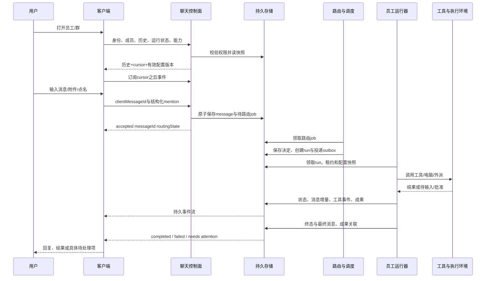

# 从零复刻 Grok Bot 的产品与实现说明

日期：2026-10-07。本文是可评审的设计，**未修改 Negus 生产代码，未宣称已实现**。事实依据在 [功能矩阵](FEATURE_MATRIX.md)；未公开的内部实现用提案标出。这里的“完整”指已核对的公开产品范围，不包含未经验证的内部算法、像素尺寸和隐藏功能。

## 1. 产品对象先分清

Grok Bot 的核心不是一页多模型聊天，而是长期员工身份、可共同工作的群、异步外派、工具和执行环境、产出，以及计划任务。真人公司的类比可以用于导航；权限和执行仍需真实数据约束。

| 对象 | 用户理解 | 持久字段/关系（提案） | 不能混同 |
|---|---|---|---|
| Account / Team / User | 我的账号、团队、真实成员 | accountId tenantId userId membership role entitlement | 浏览器 localStorage 的显示名不是真人身份 |
| Employee / Bot | 姓名头像、职责、长期偏好 | employeeId ownerId scope profile instructionsVersion environmentPolicy | employeeId 不等于模型、供应商配置、系统进程 |
| EmployeeConfig | 员工怎么运行 | providerConfigId model effort effectiveVersion | 同员工换模型不能变成新员工或丢历史 |
| Conversation | 我和谁聊、哪个群 | conversationId kind title description projectId nullable visibility createdBy | 任务标题不是员工名字；群也不是项目的唯一数据实体 |
| Membership | 哪些人/员工在群中 | memberId kind employee/user joinedAt leftAt role revision | 名字相同不等于同成员；退出不抹掉旧署名 |
| Section / Project | 如何归类、工作属于哪里 | sectionId userId; projectId owner ACL workspaceRef | 竞品section只是组织侧栏；Negus项目还可能决定cwd及权限 |
| Message / MessageBlock | 聊天内容、工具卡和附件 | messageId conversationId threadId rootId seq authorKind authorId clientMessageId blocks createdAt | SSE增量不等于第二条完整消息 |
| Mention | 点名、引用能力 | entityType entityId start end displayName | @技能/connector/group不是都启动员工；代码里的@不应触发 |
| Thread / Reaction | 针对某条结果讨论、轻量回应 | rootMessageId replies; reaction messageId userId emoji | 引用消息与独立线程不同；点赞不是授权 |
| Run / Task | 这次正在做什么 | runId taskId sourceMessageId actorId employeeId conversationId state intentTitle configSnapshot parentRunId | 对话会继续，任务会完成；title不要覆盖长期员工身份 |
| Handoff | 谁派谁做、回哪里 | handoffId parentRunId sourceConversationId targetConversationId targetEmployeeId payloadRef state | 含@的聊天文字本身不是可靠外派事件 |
| Approval / InputRequest | 等我作出什么决定 | approvalId runId actorId payloadHash scope ruleVersion expiresAt nullable decision | 有审批请求和已批准是两状态；聊天里说“知道了”不一定批准 |
| Artifact | 真正交付的文件、链接 | artifactId runId messageId storageRef mime sha version sourceRefs visibility | 做完计算不等于成果已保存、可访问、送达 |
| Skill / Routine | 可复用工作方法、定期工作 | skillId version scope; routineId owner employeeId schedule timezone trigger instructionVersion enabled | routine定义与一次run不同；Test也是真运行 |
| Plugin / Connection / Secret | 工具安装、账户授权、凭据 | pluginId enabledTools; connectionId userId label authState; secretId name encryptedValue | Installed不等于Connected；工具OAuth与事件订阅不同 |
| Environment / Screen | 工作电脑、员工屏幕 | environmentId owner/securityScope lifecycle persistentVolume; screenLease employeeId | 一个进程、一线程、一屏幕、一VM是不同层 |
| ReadState / Notification | 已读、需我处理、提醒 | userId conversationId lastReadSeq; outbox deliveryId deviceId | 已读不意味着审批已处理；关通知不停止工作 |

建议 title 与 intentTitle 分开。用户在“调研”对话里要求开始改代码，新的 run.intentTitle 更新为“修改代码”，对话标题是否随之变更由用户体验定义决定。预计产出可以挂在 run.expectedDeliverables，先当提案/计划，完成后用真实 artifact 对应，不能把“预计”冒充交付。此为 Negus 设计，不是官方已核实功能。

## 2. 用户从打开应用到收到回复的完整链路



每个小步必须能单独判断成功与失败：

1. **打开应用**：账户验证与后端连接分开报告；不能将项目数据服务 530 显示成模型不回复。健康探测区分静态页、API、SSE、供应商、执行环境。
2. **打开对话**：先检查访问权限和会话存在，再取 roster/history/runs。标题区让用户知道聊天对象和项目/临时归属。没有项目不是报错，也不能猜一个项目。
3. **显示运行设置**：后端返回实际有效配置及版本；UI不要用上次浏览器默认覆盖本对话。已有对话覆写值、员工默认值、供应商可选能力按明确优先级解析，保存和启动只调用同一个解析函数。
4. **订阅更新**：快照附cursor；用cursor补事件后再实时订阅，堵住快照与订阅之间漏消息窗口。关闭页面不cancel任务。
5. **输入与上传**：附件先上传完成并取attachmentId；失败保留文本草稿。输入法组合中Enter不发。多端草稿政策需明确，不依赖消息当草稿。
6. **提交**：clientMessageId生成一次、重试沿用。服务端校验非空、成员、引用和附件权限；原子保存消息及路由任务。只有消息落库时回答accepted；不能说员工已启动。
7. **选回复者**：显式@使用成员ID，普通消息走明确auto policy。决定记录routeId mode candidateIds selectedIds reason/source revision latency；前端只显示有意义的状态，不暴露调试面板。
8. **调度**：创建独立run记录并投递；provider启动慢不占用HTTP请求。展示queued与running区别；进程可按需复用，不是用户一打开就给每个配置启动后台。
9. **上下文**：员工职责、群说明、项目信息、当前分派、线程根、许可内历史、附件引用、记忆来源分区构建。记录上下文版本和消息cursor；不把其他私聊全量灌入。
10. **执行**：adapter屏蔽原生协议差异，输出统一事件。需要shell/MCP/电脑时统一做工具权限与真实结果记录。tool开始≠tool成功。
11. **追加/取消**：用户新指令区分“给当前run追加要求”和“开始下一任务”；steer有accepted/applied/rejected。cancel针对runId；先cancel_requested，得到执行器确认后cancelled。已完成副作用不能回滚式承诺。
12. **交接**：创建handoff记录，目标任务有来源/收件人/任务/输出位置。目标忙则排队，收到结果写回正确来源会话，用户可直接打开外派会话继续交流。
13. **交付**：最终文本、成果关联、run终态、待通知outbox原子提交；artifact保存失败要单列，不能成功回复“文件已交付”。
14. **呈现与提醒**：同messageId的delta与final合并；工具事件id去重；客户端render记录对应eventSeq。needs attention不随读消息清掉。
15. **恢复**：刷新/重启读事实状态；已接受而未开始的任务继续；处理中根据provider native turn查询，状态不明标reconciling而不盲重做外部动作。

## 3. 谁回复：可选方案与推荐

**官方确认的是体验规则，未确认选人内部算法。** 不能声称官方采用负责人调度、每Bot并发判断、轮询或所有Bot全回复。

| 方案 | 普通消息体验 | 代价/失效模式 | 适配Negus |
|---|---|---|---|
| 固定群接待者 | 无@先由一个负责人回复，再交接 | 简单可靠；专门问题可能多一次转交 | 最小改动备选，接待者规则需明确 |
| 单个路由判断选合适员工，失败回群接待者 | 不必@，多数问题由合适角色回应 | 额外模型调用；需要候选约束、失败回退 | 推荐目标方案；独立可替换函数 |
| 每Bot先独立判断是否回应 | 各员工自主参与，更近字面描述 | 多次推理、重复回复、都沉默 | 若产品真的要求自主才选，不默认实现 |
| 全员对每条消息执行 | 多视角回复 | 费用与噪音高、互相等待/循环 | 不作为默认，也不能说官方如此 |

推荐的自动策略是**提案**：显式点名优先→回复线程原负责人/已有明确任务负责人→auto router选择成员内目标→路由故障时接待者。接待者未定义时给出具体可恢复的待分派状态，不能把成功保存当成有人正在看。可以通过一个routeMessage接口逐步替换，不加多套全量运行服务。

Router输入只取需要的公开上下文、职责、成员/能力、任务状态，输出受约束JSON；工具能力不在router层执行。是否选择多成员根据明确多职责需求，不因欢迎语让所有员工跑一遍。置信阈值如要用需调优，本文不凭空指定0.8或新次数限制。

@everyone是广播意图，但“通知所有”是否“让所有执行”应有清楚产品定义；官方用语不能推导每人必回。显示名只用于呈现。粘贴旧聊天、代码块、邮箱、引用文字中的@默认不是新工具调度；UI选中的结构化mention才有优先明确性，纯文字解析可作为兼容输入且保留歧义反馈。

## 4. 异步外派、协调和可恢复工作

状态建议：

```text
accepted → routing → queued → starting → running
running ↔ waiting_input / waiting_approval / waiting_handoff
running → succeeded / failed
任何未终结状态 → cancel_requested → cancelled（执行器确认）
断连或服务重启 → reconciling → 原状态或 failed / outcome_unknown
```

等待输入不是失败；供应商拒绝是失败；事件断连不是任务失败。成果回报deliveryState另有pending/delivered/failed，task成功不能代替已送达。outcome_unknown用于外部请求已发但响应丢失且目标端不能查询的情况，避免重复发送邮件/支付。

外派必须有 `handoffId parentRunId rootTaskId sourceConversationId targetConversationId targetEmployeeId sourceMessageId instruction attachmentsRef actorUserId policySnapshot`。来源员工立即取得接单回执，目标完成后回执排队进入来源；主对话忙时保留回报，不能把结果写到浏览器当前页。依赖研究→写作→审核时依赖明确结果，而不是“上一人回复过就算完成”。

多个员工可独立工作；同一native线程并发是否允许由adapter能力决定，不假定。初期同线程串行、多线程并行即可。群内消息统一seq但不把所有群任务锁在一个currentRun。共享文件使用版本或资源锁，屏幕独占租约按实际员工屏幕，必要外部工具限额由运行环境能力给出。

循环控制应优先识别父子关系、重复handoffId、已经等待的依赖和没有新输入的回声，不按“每员工本轮只能醒一次”截断合理的研究→审核→返工。真实资源限额另可配并明确反馈，不能暗加用户未说的次数/时间限制。

重启恢复：先扫描非终态和租约；查询provider线程/turn实际状态；补未发送事件和通知；对已完成有messageId的事件幂等重放。缺原生恢复接口时显式标需要重试，不假称所有工作无缝续跑。客户端重发旧消息时返回原message和execution，不创建重复run，也不能因为历史accepted但job丢失就永久没人执行。

## 5. API与事件合同（可复用现有路径）

以下名称是设计合同，不是宣称已有端点。现有group/message、history、interrupt及单聊API可通过adapter逐步兼容；不并行创造三套消息协议。

| API动作 | 必要请求 | 返回与失败 |
|---|---|---|
| 创建员工 | clientRequestId profile role instructions configRef | employee及revision；重复返回同对象 |
| 创建群 | clientRequestId memberIds title description projectId nullable | conversation及membershipRevision |
| 修改成员/资料 | expectedRevision patch | 新revision；409返回最新可重试资料 |
| 聊天快照/历史 | conversationId before/after/around cursor | messages roster runSummaries effectiveConfig eventCursor |
| 发送消息 | clientMessageId text blocks mentions replyTo threadId attachmentIds | accepted messageId route/run refs；明确deduplicated |
| 追加当前任务 | runId clientCommandId instruction | accepted/applied/rejected commandId |
| 取消任务 | runId clientCommandId | cancel_requested或既有终态；不可一句“成功”遮实际运行 |
| 回答批准/输入 | approvalId decision expectedPayloadHash | applied/expired/forbidden/stale；重复决定幂等 |
| 外派 | parentRunId targetEmployeeId instruction targetConversationId optional outputContract | accepted handoffId targetRunId |
| 上传/下载成果 | purpose conversationId content metadata | storageId scanned/ready；权限/媒体/容量错误 |
| 搜索 | query scopes cursor | 有权限结果及真实跳转messageId/rootId |
| routine CRUD/test/history | definition revision timezone trigger references | saved effectiveNextRunAt；Test返回runId |
| 读状态/提醒偏好 | conversationId lastReadSeq 或bot/device policy | 单调lastReadSeq；attention独立 |
| 插件/账户连接 | pluginId connectionId label scope OAuth callback state | installed/needs_auth/connected/disabled/revoked |

统一事件信封：`eventId eventSeq schemaVersion tenantId conversationId messageId runId parentRunId actorId occurredAt type payload`。事件类型至少有 message.created/delta/final、route.decided、run.queued/started/phase/final、tool.started/completed/failed、handoff.created/delivered、approval.requested/resolved/expired、artifact.ready/failed、membership.changed、routine.changed/run、environment.health、notification.delivery。敏感值不进event payload。

需要持久化原子关系，不必立刻全套微服务：单Node服务+事务数据库+worker足以第一阶段。run、outbox和message可在同一事务表中；UI共享MessageList、Composer、ConversationHeader、MemberPicker、TaskStatus、ApprovalCard、ArtifactCard、HistorySearch。分层目的是删掉重复入口逻辑，不是每对象一个服务。

## 6. UI逐处规范与状态

公开文字不足以证明具体宽度、颜色、动画与点击坐标；以下布局延续用户授权的飞书方向，属于Negus方案，**不是Grok Bot像素复刻**。

| 区域 | 常态与操作 | 空/等待/错误状态 | 共用方式 |
|---|---|---|---|
| 全部 | 最近消息和员工入口；置顶分组；原点击进入 | 尚无会话时引导创建；不显示假群 | ConversationRow按kind渲染 |
| 员工 | 显示员工；右侧展开外派对话；点本行仍开原聊天 | 无外派不假造任务；已完成仍是可继续聊的对话 | 树形容器复用行组件 |
| 项目 | 项目总群及下属对话按时间更新 | 未归项目显示临时；项目总群没创建则明确入口 | projectId过滤同一会话集合 |
| 任务 | 正在运行/需处理/定期/已完成；一项可跳所属对话 | queued不叫运行中；failed与已完成区分 | RunRow链接Conversation，不另造聊天 |
| 顶部新建 | 员工/单聊/群聊；多选员工；群名说明项目 | 创建中按钮去重；失败保留选项 | MemberPicker与创建弹窗共用 |
| 会话头 | 员工或群身份、项目/临时归属、成员详情 | 被移除或未发布显示真实原因 | Header由metadata驱动 |
| 消息 | 用户头像及标识在右；员工各署名；引用线程 | delta占位、失败、成果未完成分开 | 同MessageList blocks驱动 |
| 输入 | draft text attachments @ / voice能力 | 禁发条件精确；失败草稿保留 | 共用Composer控制器 |
| 详情 | 员工职责、群说明、成员、skills/routines/plugins | 无权控件缺失且后端拒绝 | Details sections按capability |
| 审批/接管 | 操作对象、影响、输入、可选动作 | expired/stale/resolved只显示事实 | 同run状态事件驱动 |
| 产出 | 预览、下载、来源、更新版本 | 传输失败重试；链接失效如实说明 | ArtifactCard共用单聊群聊 |
| 搜索 | 跨范围、员工群文件routine、匹配上下文 | 无结果与无权限不同；加载分页 | 同SearchResults键盘触摸适配 |
| 设置 | 账户、主题、语言、通知、有效配置、插件 | installed/auth/env故障分开 | 使用已有配置解析和能力目录 |

桌面和触屏：列表键盘可达、Escape关闭并返回原焦点，右键菜单有触摸入口；抽屉不覆盖发送状态。不要给所有消息强制增加debug文字；后端需保留完整链路。

完整竞品快捷键参考：Cmd/Ctrl+K搜索；Shift+F搜Bot；N新建；F本聊查找；B收侧栏；I或L聚焦输入；1–9侧栏员工；Alt上下切员工；方括号访问历史；ControlTab/ShiftTab循环员工（Mac也Control）；ShiftM或ShiftW插件；Shift逗号Bot设置；Mac ShiftI或AltB详情/WindowsLinux AltB；Enter发/ShiftEnter换行/CmdCtrlEnter全局发；D听写；逗号设置；加减0缩放；F11全屏、Mac ControlCmdF。实时语音无快捷键。与浏览器键位冲突的Web版不能盲覆盖，需要根据运行壳判断。

语音：听写先草稿再发；实时call有connecting/active/muted/ended/failed、只一通lease、可切聊天、结束写时长/转录卡。群及别人Team Bot不提供竞品实时通话；语音memo是成果播放器。要复刻全量语音需STT/TTS/realtime适配与麦克风权限，但初期可保持入口能力明确，不假按钮。

## 7. 文件、技能、routine与共享电脑

附件上传和团队知识文件不同。上传校验mime、大小、真实格式，扫描/解析状态与消息关联；预览服务独立授权，HTML/notebook内容不获得同源执行权限。共享电脑的文件需要路径范围和版本检查；artifact保存/链接/下载按run的可见性，不用任意本机绝对路径开放下载。

技能保存how-to、输入、检查、输出和边界；版本与员工启用关系独立，私人skill可共用但私人对话不能共享。Teach任务是录制/生成草稿，不是暗中录用户麦克风或凭据。产出的技能必须能审阅。

routine定义记录owner、employee、instructionVersion、schedule/timezone或trigger、outputDestination、authorization refs、enabled、nextRunAt。一次run与普通手动任务共用执行器。DST重复/跳时、停机错过时间、暂停期间事件、排队积压、owner被删除、源账户过期需明确政策，不能靠“模型记住每周跑”替代调度器。可先不补跑过期任务，前提显示missed事实并由产品决定是否补跑；不新增隐藏超时或离线暂停规则。

webhook要校验Bearer并去重事件；返回accepted并非产出完成。Slack事件签名/重发id校验；“读消息”授权和“事件触发”授权不同。Test能有真实副作用，页面说明一次即可；不假作dry run。

官方普通账户一个云电脑、多Bot屏幕，Team Bot共享场景另有环境；**Negus若保留本地执行，不能声称复刻了Firecracker多租户隔离**。先用environment adapter封装local/native；要提供真正账号间隔离再采用独立容器/VM、凭据范围和存储隔离。是否每员工独立电脑是产品/成本选择，不从现有provider进程推断。屏幕不是权限边界。

电脑维护定义update-software/update-image/recover/reset/terminate/delete-data，备份时点和将丢package清晰可见。初期不做云电脑功能时不放可点击伪控件，不因完整竞品范围而擅自操作本机或生产服务。

## 8. Team Bot与企业全量范围

Team Bot不是把同一个私聊给全公司看：共享定义、知识与明确团队记忆，每用户私聊和notes私有，owner也不能读。OAuth动作归提问者，service key归Bot服务凭据；私人connector grant按person+plugin+Bot/team范围保存可Clear。官方帮助中心与索引文档在1对1授权和approval适用场景存在差异，以REPORT列出的冲突等待产品版本实测，不能自行合成“唯一官方逻辑”。

owner setup→发布→用户Add→私有聊天；取消发布保留聊天与routine→再发布恢复；删除移除全队数据和Slack App。个人Bot转团队是副本+逐项审核，模板是接收者独立拷贝，三个动作完全不同。共享memory写入必须显式团队范围；技能发布权限独立。

Slack adapter：DM每条唤醒；频道顶层需@；进入线程之后跟进回复不用再@；线程映射conversation；没有@的其他顶层忽略，listener routine是单独选择。每用户link身份并验证team membership，工具connector发消息作为授权用户，Team Bot Slack app作为Bot，这两套发言身份不要混。

完整企业能力还包括SSO/SCIM、启用与目录group access、connector allowlist、team/group规则、AutoReview锁与授权、网络policy、team setup、team secrets、computer operations、action recording、audit、OTel内容导出、usage与analytics。可复刻体验但不能承诺竞品认证/协议/驻留与我们等同。无需现在把企业全套塞进Negus；在覆盖矩阵保留目标和依赖即可。

## 9. 全链路debug日志

符合用户既有要求：详细debug在后端，前端呈现具体失败与requestId，不加日常操作的诊断杂音。

一次行为至少关联 `traceId clientActionId requestId conversationId employeeId sourceMessageId runId handoffId providerThreadId turnId configVersion buildSha eventSeq`。阶段包括 ui.action_received → api.validated → message.persisted → route.decided → job.enqueued → worker.claimed → provider.started → tool.result/approval/handoff → artifact.persisted → run.finalized → response.sent → ui.event_received → ui.rendered。

最后两个可通过轻量客户端观测回报关联，不能后端发了SSE就推断页面已显示。连接断开时注明未收到呈现回执，而非伪造成功。日志的status/reason/duration/attempt/actor/policy版本结构化；正文、凭据、Cookie、OAuth token默认不输出；用户内容debug若有明确需要要另具访问/保留规则。

版本链要同时回答：源码HEAD、工作区是否dirty、构建commit与时间、启动进程使用的构建路径与SHA、UI静态资源version、后端version、runtime/provider版本。不能因为GitHub最新就说本地正在跑最新。rollback记录之前之后SHA、操作者与启动时间；仅看文件mtime不能证明回退。

## 10. 真实场景从入口反推

| 场景 | 从哪里开始 | 工作链/产出 | 必须处理的边界 |
|---|---|---|---|
| 普通用户在新群问有人吗 | 全部→群 | 接待回复、介绍成员 | 无@不沉默；不启动全员重活 |
| 竞品调研→文案→审核 | 群输入点名职责 | 研究证据→草稿→审核；返工仍同群可追踪 | 缺证据不进入通过；多轮不受一次唤醒限制 |
| 调研对话改为写代码 | 员工展开外派→原对话 | 同conversation新run任务标题与成果 | 历史保留、项目/cwd明确、当前任务标签更新 |
| 用户关闭电脑等结果 | 发完任务离开 | 云/后台运行→成果→通知 | 刷新不重跑、去重通知、可跳真实任务 |
| 执行中用户变更要求 | 当前聊追加 | steer确认→后续采用新要求 | 已发生副作用说明；不把追加变新独立争抢任务 |
| 中断一个任务 | 任务行Stop | cancel_requested→confirmed | 不取消别群、不说已回滚 |
| 销售准备客户外联 | 销售Bot | 读CRM/网页→候选→邮件草稿→按用户指令发送 | OAuth账号、收件人与版本绑定 |
| 招募筛选与安排 | 招募Bot | 职位标准→资料→短名单/面试安排草稿 | 个人信息范围、Calendar账户、权限 |
| 广告预算建议 | 营销Bot/群 | 读取投放→统计→预算建议 | 数据时间范围、写入权限、不得假称已改预算 |
| 费用核对 | 财务Bot附件 | 发票/表格→对账→例外清单 | OCR失败、共享成果、不能重复付款 |
| 绩效报告 | routine/绩效Bot | 时间段事实→报告→定期交付 | 时区、source失效、缺数据有具体状态 |
| Bug复现与修复 | 开发群 | 截图→环境→复现→修复产出/测试 | 电脑和model服务不同、stop影响、产出实际可读 |
| 客户健康监测 | routine/账户Bot | 数据触发→评估→告警 | 事件重放、噪音、source授权 |
| Chief of Staff分派 | negus助手/总群 | 澄清目标→分工→依赖→交付总结 | 用户无需每步手动协调，完成与预计分别展示 |
| 团队共享数据助手 | New→Team Bot | owner配置发布→同事私聊 | 私人记忆与OAuth隔离；不借owner账户 |
| Slack咨询 | DM或频道@ | link身份→线程回答→可回应用 | 普通群和Slack规则不同；非团队者不回答 |
| 周一自动报告 | routine入口 | nextRun→后台→任务/结果 | 计划保存不立刻执行；Test真运行；暂停future |
| 手机分享文件继续 | OS分享→draft | 选择对话→编辑→发送→成果 | 不误发另对话；原生分享能力平台差异 |
| 云电脑无法连接 | 任意聊→环境提示 | 保存历史→连接诊断→恢复 | 不删聊天、不反复Reset造成新损失 |

## 11. 由现有Negus增量推进，减少重复代码

源码核对基于本机dirty工作区，不以过时产品文档替代事实。

| 顺序 | 改动方向 | 复用/删减 | 完成标准 |
|---|---|---|---|
| A 群普通消息闭环 | 统一routeMessage；无@明确自动接待/选人；群说明 | 复用resolveAgentRouting和消息提交；删除无目标假listening执行语义 | 普通消息有回复；@仍准确；失败可查 |
| B 任务事实持久化 | message+job原子、run/outbox、重连恢复 | 把researcher持久任务能力抽成通用核心；复用原生线程运行 | 重启不丢接单；重复请求不双跑 |
| C 外派和控制 | 通用handoff与来源回报；每run steer/cancel | 合并群与单聊执行状态；逐步去掉终稿@文本作为唯一交接 | 两次往返/来源忙/停止范围都通过 |
| D 员工和群生命周期 | 动态员工CRUD 成员修订 详情标题归属 | 复用EmployeePicker/Profile/ConversationRow；不新写两套消息页 | 创建重启保留；成员变化不误路由 |
| E 线程搜索产出提醒 | thread/reaction search artifacts readState/outbox | 复用history cursor与原生消息blocks | 跨端状态一致；结果始终能定位 |
| F routine技能工具 | 通用scheduler event入口 knowledge版本 | 同一run执行器和TaskDetails；技能/连接能力目录共用 | 定期/事件/Test有实际证据与失败原因 |
| G 全量补齐 | 语音/远程电脑/Team Bot/企业管理 | environment/policy/plugin adapters；按需求接入 | 对应公开能力矩阵逐项验收 |

A可独立小步演示，但不能因此说“完整复刻已完成”。B/C是可靠群协作的骨架；E/G多端、语音、电脑、企业的工程规模显著更大。尚未实施不能给虚假的小时交付承诺。估算前需确定是否做云托管、多真人、多供应商、原生手机、企业SSO与远程电脑；这些有运行成本与外部凭据依赖。

本文没有决定要给每对话造一个新进程，没有增加群人数/自动暂停/审批超时等Negus产品限制，也没有创建第三方账户或执行竞品消息。正式开发前与用户只需确认影响体验的选项；工具常规实现选择可按已授权原则自行处理。
